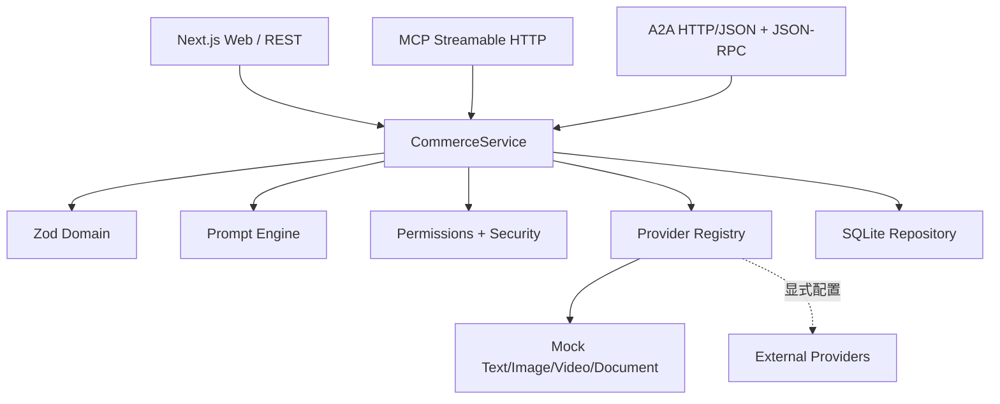

# 系统架构

## 模块图

## 依赖边界

`domain` 不依赖业务实现；`database` 只保存经过领域层验证的数据；`prompt-engine` 只编译和评估 PromptSpec；`providers` 隔离外部 SDK；`permissions` 做 scope/project/IP 判断；`security` 提供边界校验；三个服务入口只做协议映射和错误映射。

## SQLite 数据模型

31 张实体表使用统一元数据列和 JSON 载荷，便于 MVP 快速演进，同时为 workspace、project、status、version、parent 建索引。事实、快照、PromptSpec、ArtifactVersion 保持独立实体，不能把版本覆盖成一行。`idempotency_keys` 和 `rate_limits` 是协议治理表。

关键关系：Workspace 1:N Project；Project N:1 Brand、N:M Product；Project 1:N Source/Fact/Snapshot/PromptSpec/Artifact/Job；Artifact 1:N ArtifactVersion；AgentServiceAccount 1:N Connection/Permission/AuditEvent。

## 多租户和信任边界

所有仓储读取默认带 `workspace_id`。外部身份还需通过 scope 和 projectIds；服务端不接受客户端自报 workspace。Token 使用 pepper 后的 SHA-256 摘要查询，撤销和过期由数据库条件强制执行。MCP/A2A/REST 共享相同 CommerceService，避免不同协议产生权限旁路。

## 扩展路径

SQLite Repository 可替换为 PostgreSQL；本地文件路径可替换为对象存储；同步 Mock Provider 可替换成队列 Worker；任务事件已提供 SSE 语义。迁移时保持领域 ID、快照和版本语义不变。
