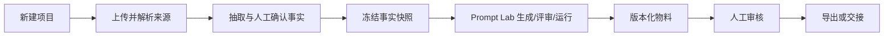

# 产品规格

## 产品判断

电商 AI 的主要失败并不是“模型不会写”，而是项目事实、来源证据、版本、权限和审核散落在对话里。因此工作台以项目为最小业务单元，以事实快照为所有生成的输入版本，以 Artifact Version 为所有产出的审计边界。

## 用户与任务

- 运营负责人：建项目、确认事实、拆目标、审结果。
- 内容生产者：在既定事实和品牌约束内生产文案、图像、视频与方案。
- 审核者：对价格、规格、活动时间、资质、功效、知识产权和发布动作作决定。
- 外部智能体：使用项目范围 Token，通过 REST、MCP 或 A2A 读取最小上下文并回写草稿。

## 核心旅程

## 信息架构

首页负责经营总览和快捷意图；项目负责上下文；品牌、商品、知识库负责可复用事实；模板和技能负责生产能力；任务和审核负责运行治理；智能体页面负责连接、权限和日志；API 文档与集成页负责开发者接入。

## 状态约束

来源必须先解析；事实只有人类可确认；PromptSpec 必须指向快照；Artifact 必须有不可变版本；高风险字段必须进入 Review Request；外部智能体默认只能创建草稿；事实变化后旧物料标记为可能受影响。

## MVP 验收

- 无密钥本地启动，虚构项目可走完“资料→事实→提示词→物料→审核”。
- 主要页面、REST 接口、MCP 资源/工具/提示词、A2A Agent Card 与任务接口可访问。
- 工作区和项目范围在每次读取/写入时检查；Token 可撤销且明文不入库。
- 上传、Webhook、幂等、限流、日志脱敏有自动化测试。
- 桌面与移动端可用，核心交互有加载、空、错、成功、待审核状态。
